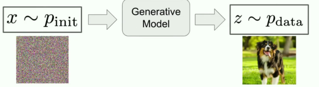

+++
date = '2025-12-27T16:15:50+08:00'
draft = true
title = 'Flow学习笔记'
categories = ['笔记']
tags = ['flow', '大模型']
+++

## 生成式模型
generate something——generate samples from data distributions  
A generative model——convert samples from a initial distribution(e.g.Gaussian) into samples from the data distribution

## 组成
一个空间的向量场 $u_t$（神经网络）定义了一个常微分方程（ODE），轨迹 $X_t$ 是ODE在某初始条件下的一个解，flow——$Φ_t（x_0）$则是针对不同初始条件的一系列解的集合
ODE（用于流模型，本文采用）：
$X_0=x_0, \quad \frac{dX_t}{dt} = u_t(X_t)$  
SDE（在ODE基础上添加扩散系数σt，用于扩散模型）：  
$X_0=x_0, \quad dX_t = u_t(X_t)dt + σ_tdW_t$
## 训练目标
最大似然估计（MLE）  
给定数据分布 $p_{data}$ 和模型分布 $p_{model}$，MLE目标是最大化观测数据在模型下的似然函数：  
$L(θ) = \prod_{i=1}^{N} p_{model}(x_i; θ)$  
等价于最小化负对数似然：  
$J(θ) = -\sum_{i=1}^{N} \log p_{model}(x_i; θ)$  
