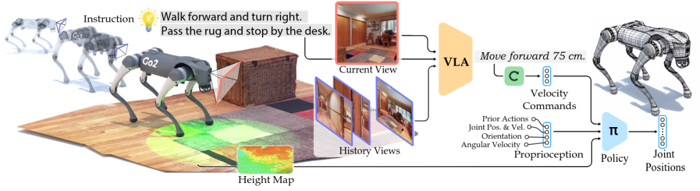
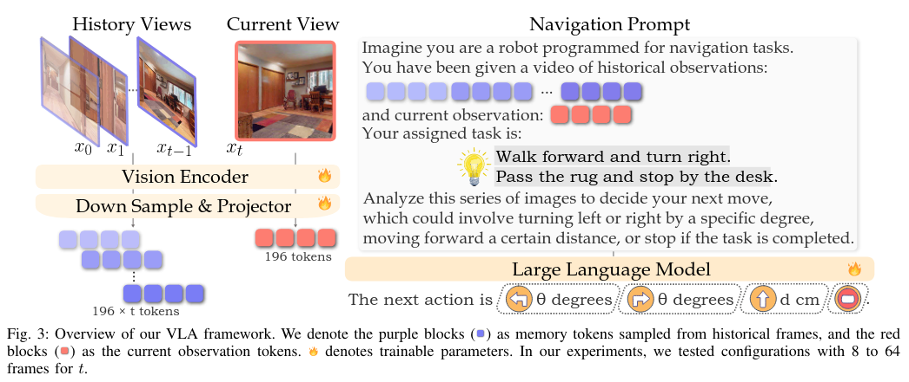

+++
date = '2025-12-24T12:39:23+08:00'
draft = true
title = 'Navila复现笔记'
categories = [
    "Notes",
    "VLA",
]
+++
## 论文解读
Navila: A High-Performance and Energy-Efficient Vector Length Agnostic SIMD Architecture  
### 两级框架
* 高层次视觉语言理解：VLM输出语言形式的中级动作，例如“右转 30 度”
* 低层次运动控制：训练一个低级视觉运动策略来遵循指令以进行执行

### 实现方法
1. 训练VLA用于导航
    * 选择基于图像的视觉语言模型VILA
    * 将历史和当前观测的标记与导航指令整合，构建导航任务提示
    * 从人类视频中收集轨迹-指令对以增强导航能力

2. 视觉移动策略
    * 机器人配备一个安装在其头部底座的 LiDAR 传感器，以 15Hz 的频率广播点云
    * 将VLM输出的可执行指令转换为具体的速度指令，例如将{前进，向左转，向右转，停止}转换为{0.5 m /s，π/6 rad/s， −π/6 rad/s ，0}
    * 采用PPO算法训练控制策略，动作空间定义为期望的关节位置，观测空间包括本体感知、速度指令、以及机器人附近地形的高度


## 实验复现(评估部分)  
### 环境配置
1. 创建模型评估的虚拟环境
```bash
conda create -n navila-eval python=3.10
conda activate navila-eval  # 后续pip安装均在该环境下进行
```

2. 安装 Habitat-Sim and Lab(v0.1.7),参考[VLA-CE设置](https://github.com/jacobkrantz/VLN-CE?tab=readme-ov-file#setup)  

由于Habitat-Sim(0.1.7)只支持python3.6~3.9，在3.10环境下需要采用源码安装

```bash
# 安装Habitat-Lab
git clone --branch v0.1.7 https://github.com/facebookresearch/habitat-lab.git
cd habitat-lab
# installs both habitat and habitat_baselines
python -m pip install -r requirements.txt
python -m pip install -r habitat_baselines/rl/requirements.txt
python -m pip install -r habitat_baselines/rl/ddppo/requirements.txt
python setup.py develop --all
```
安装Habitat-sim(v0.1.7),参考[官方源码安装指南](https://github.com/facebookresearch/habitat-sim/blob/v0.1.7/BUILD_FROM_SOURCE.md)

```bash
git clone https://github.com/facebookresearch/habitat-sim.git #（默认就是v0.1.7）
cd habitat-sim
git submodule update --init --recursive
git checkout v0.1.7
git submodule update --init --recursive #注意切换分支后可能导致部分submodule无效

python -m pip install -r requirements.txt
# 如果出现路径问题编译不成功，可能因为之前编译过了，进入到habitat-sim目录删除build(rm -rf build)

python -m pip install cmake
sudo apt-get update || true
sudo apt-get install -y --no-install-recommends \
     libjpeg-dev libglm-dev libgl1-mesa-glx libegl1-mesa-dev mesa-utils xorg-dev freeglut3-dev

# 可能出现安装libgl1-mesa-glx不成功，可以尝试单独安装以下两个依赖
# sudo apt-get install libgl1-mesa-dev
# sudo apt-get install libegl1-mesa-dev

python -m pip install --upgrade pybind11

# 注意，编译要采用headless模式
python setup.py install --headless --cmake-args="-DCMAKE_POLICY_VERSION_MINIMUM=3.5 -DCMAKE_CXX_STANDARD=11"
```
编译时若遇到error: ‘uint16_t’ in namespace ‘std’ does not name a type; did you mean ‘wint_t’?报错,在编译时添加 cstdint 头文件：
```
python setup.py install --headless --cmake-args="-DCMAKE_POLICY_VERSION_MINIMUM=3.5 -DCMAKE_CXX_STANDARD=11 -DCMAKE_CXX_FLAGS=-include\ cstdint"
```
解决 NumPy 兼容性问题
```bash
cd Navila
python evaluation/scripts/habitat_sim_autofix.py # replace habitat_sim/utils/common.py
```
3. 安装VLN-CE依赖
```bash
python -m pip install -r evaluation/requirements.txt
```
4. 安装VILA依赖
```bash
# 安装 FlashAttention2
python -m pip install https://github.com/Dao-AILab/flash-attention/releases/download/v2.5.8/flash_attn-2.5.8+cu122torch2.3cxx11abiFALSE-cp310-cp310-linux_x86_64.whl

# 安装 VILA (假设在项目根目录下)
python -m pip install -e .
python -m pip install -e ".[train]"
python -m pip install -e ".[eval]"

# 安装 HF 的 Transformers
python -m pip install git+https://github.com/huggingface/transformers@v4.37.2
# 替换部分包以兼容
site_pkg_path=$(python -c 'import site; print(site.getsitepackages()[0])')
cp -rv ./llava/train/transformers_replace/* $site_pkg_path/transformers/
cp -rv ./llava/train/deepspeed_replace/* $site_pkg_path/deepspeed/
```
5.修复 WebDataset 版本以实现 VLN-CE 兼容性
```bash
python -m pip install webdataset==0.1.103
```
### 数据集下载
1. 参考[VLA-CE](https://github.com/jacobkrantz/VLN-CE?tab=readme-ov-file#setup)下载R2R和RxR数据集，并解压到`evaluation/data`路径
2. 下载Matterport3D数据集，可通过[官网](https://niessner.github.io/Matterport/)申请获取，也可参考[mp3D 数据集](https://blog.csdn.net/qq_41204464/article/details/149549133)

数据应具备如下结构：`evaluation/data`
```
data/datasets
├─ RxR_VLNCE_v0
|   ├─ train
|   |    ├─ train_guide.json.gz
|   |    ├─ ...
|   ├─ val_unseen
|   |    ├─ val_unseen_guide.json.gz
|   |    ├─ ...
|   ├─ ...
├─ R2R_VLNCE_v1-3_preprocessed
|   ├─ train
|   |    ├─ train.json.gz
|   |    ├─ ...
|   ├─ val_unseen
|   |    ├─ val_unseen.json.gz
|   |    ├─ ...
data/scene_datasets
├─ mp3d
|   ├─ 17DRP5sb8fy
|   |    ├─ 17DRP5sb8fy.glb
|   |    ├─ ...
|   ├─ ...
```
### 评估运行
1. 下载checkpoint  

从[a8cheng/navila-llama3-8b-8f](https://huggingface.co/a8cheng/navila-llama3-8b-8f)下载预训练模型，并解压到`evaluation/models/navila-llama3-8b-8f`路径下,可通过以下命令下载：
```bash
# 安装 huggingface_hub
python -m pip install huggingface_hub
```
创建下载脚本`download_huggingface.py`并运行,脚本内容如下：
```bash
from huggingface_hub import snapshot_download

local_dir = snapshot_download(
    repo_id="a8cheng/navila-llama3-8b-8f",
    local_dir="~/NaVILA/navila-llama3-8b-8f",  
    cache_dir="~/NaVILA/navila-llama3-8b-8f/cache", # 改成自己的项目路径
    token="hf_******",     #  这里填写你的 HuggingFace 访问token
    endpoint="https://hf-mirror.com"   # 如果需要走镜像
)

print("模型下载到本地路径:", local_dir)
```
2. 在r2r上运行评估
```bash
# bash scripts/eval/r2r.sh CKPT_PATH NUM_CHUNKS CHUNK_START_IDX "GPU_IDS"
# 单显卡
bash scripts/eval/r2r.sh /data/code/seu004/czd/NaVILA/navila-llama3-8b-8f 1 0 "0"
# 多显卡
bash scripts/eval/r2r.sh /data/code/seu004/czd/NaVILA/navila-llama3-8b-8f 4 0 "2,3,4,5"
# 检查所有Python评估进程
ps aux | grep "run.py.*navila"
# 停止当前评估
pkill -9 -f "run.py.*navila"
```
### Debug
记录项目复现过程中遇到的一些问题
1. 服务器网络问题  
复现该项目时还是初次使用服务器，服务器由于没有图形化界面，一些仿真没办法实时显示，且服务器访问国外的网站速度较慢，不像自己电脑那样可以直接搭梯子访问。不过可以通过让服务器端走本地代理的方式来解决：  
* 在本地电脑输入以下命令:
```bash
# 本地端口号7897,需要查看自己的clash等代理软件的端口号,填写其他参数记得删去占位符<>
ssh -vvv -N -R 7897:localhost:7897 -p <远程服务器端口号> <username>@<server_ip>
```
* 在服务器上设置环境变量
```bash
# 只在当前终端生效,将其写入~/.bashrc文件可以永久生效，但我没有那个权限
export http_proxy="http://localhost:7897"
export https_proxy="http://localhost:7897"
```
这样服务器就可以访问外网了，克隆github项目、下载hugging_face模型等都可以顺利进行。

2. Matterport3D数据集加载问题  
mp3d数据及下载比较麻烦，使用官方给的脚本不知道为什么只会下载scans文件夹，这里面一般是深度、RGB图片等原始数据,评估过程其实是不需要的，真正需要的是task文件夹下的文件，但即使我使用--task habitat后缀仍然没法下载task相关文件，目前没找到解决办法，我是直接去找师兄要了数据集，也可以去咸鱼上买现成的。  
最后的场景文件夹下应包括.glb等格式的文件。不同的场景有不同的ID，理论上评估预训练模型需要许多场景，但我实测先装一个ID为zsNo4HB9uLZ的场景就可以跑通评测，过程中有的episode发现没有的场景会直接跳过，后续可以慢慢补充其他场景再进行评估。

### 实验结果
待定