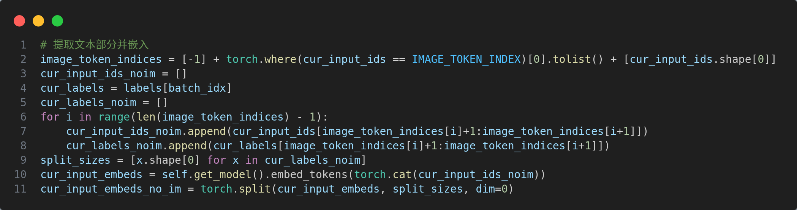
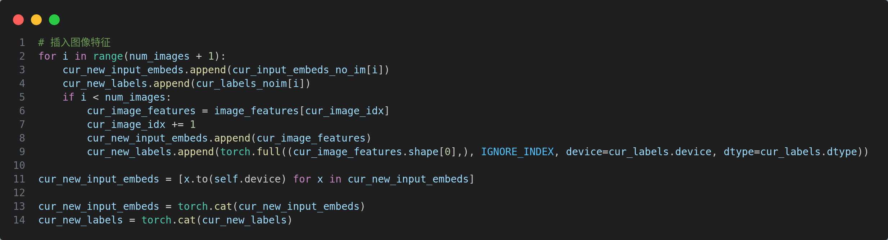

## VLM
### LLaVA
`prepare_inputs_labels_for_multimodal()` 函数解读  
[源代码](https://github.com/haotian-liu/LLaVA/blob/main/llava/model/llava_arch.py)  
该函数用于将输入文本和图像进行拼接，并生成对应的标签，是视觉语言融合的核心函数，  
事例如下：

1. 首先对原始文本进行分词
```python
"USER: <image>\n What is the color of the car? \n
ASSISTANT: "

↓ encode

124, 31, -200, 83, ..., 91  (-200 为图片索引)
```
2. 提取文本并嵌入

```python
124, 31, -200, 83, ..., 91 

↓ 提取文本

[124, 31, 83, ..., 91]

↓ 嵌入并分割

[[], []], [[], ..., []]
```


3. 插入图像特征

```python
[[], []], [[], ..., []]

↓ 插入图像

[[], [], [image_feature], ..., [], ..., []]  
```


图像特征获取如下： 


## VLA
### OpenVLA
`class ActionTokenizer`类解读  
[源代码](https://github.com/openvla/openvla/blob/main/prismatic/vla/action_tokenizer.py)

1. 将连续动作区间均匀离散化

      bins: $\underbrace{[-1.0, ..., 1.0]}_{256个边界点}$  

      $\downarrow 取区间中心 $

      bin_centers: $\underbrace{[-0.99609375, ..., 0.9960784]}_{255个中心点}$
```python
# Create Uniform Bins + Compute Bin Centers
self.bins = np.linspace(min_action, max_action, self.n_bins)
self.bin_centers = (self.bins[:-1] + self.bins[1:]) / 2.0
```
2. 动作编码  
      action $\xrightarrow{clip}$ action $\in [-1.0, 1.0] \xrightarrow{digitize}$ discretized_action $\in [1, 256]$
      $\xrightarrow{decode}$ token_id
```python
action = np.clip(action, a_min=float(self.min_action), a_max=float(self.max_action))
discretized_action = np.digitize(action, self.bins)
# 映射到词表的末尾一段token_id（对于BPE分词法，最不常用的token在词表末尾）
return self.tokenizer.decode(list(self.tokenizer.vocab_size - discretized_action))
```


